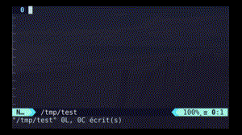

# 🐹 unicodemoji 



⏩fast unicode emojis in terminal and vim with fzf ⌨ .

based on [gitmoji](https://github.com/carloscuesta/gitmoji/) and [emojis.json](https://gist.github.com/oliveratgithub/0bf11a9aff0d6da7b46f1490f86a71eb).

# 🐯 installing (vimplug)

[Install fzf (vimplug) 💾](https://github.com/junegunn/fzf#as-vim-plugin)

Install the plugin (vimplug)

```
Plug 'yazgoo/unicodemoji', { 'branch': 'main', 'dir': '~/.unicodemoji', 'do': './install' }
```

# 🐖 installing (shell 🐚)

If you have already installed the plugin, you don't need to do that part.

You need fzf installed.

Otherwise run

```
./install
```
make sure that ~/.local/bin is in your PATH

# 🐪 using it (vim)

enter:

```
:Unicodemoji
```

if you want a shortcut:

```
nmap <leader>u :Unicodemoji<CR>
```

# 🐄 using it (shell 🐚)

With FZF:

```
$ unicodemoji
```

Without FZF (so that you can grep results) 👷 

```
$ unicodemoji --no-fzf
```
